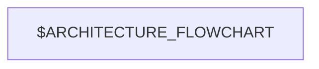
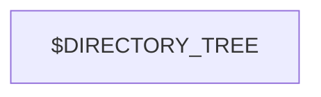

<!-- repo-analyzer
source: $SOURCE_URL
commit: $COMMIT_SHA
generated: $GENERATED_AT
schema: 1
-->

# Analysis: $OWNER/$REPO

> $REPO_DESCRIPTION

| | |
|---|---|
| **Stars** | $STARS |
| **Forks** | $FORKS |
| **Primary language** | $PRIMARY_LANGUAGE |
| **License** | $LICENSE |
| **Default branch** | $DEFAULT_BRANCH |
| **Last push** | $PUSHED_AT |
| **Created** | $CREATED_AT |
| **Disk usage** | $DISK_USAGE |
| **Topics** | $TOPICS |
| **Homepage** | $HOMEPAGE |

## Features

$FEATURES_PROSE

```mermaid
mindmap
  root(($REPO$))
$FEATURES_MINDMAP_BRANCHES
```

## Architecture & design

$ARCHITECTURE_PROSE



## Code structure

$CODE_STRUCTURE_PROSE




**Top-level directories:**

| Directory | Files | Purpose (inferred) |
|-----------|-------|--------------------|
$TOP_DIR_TABLE

## Key workflows

$KEY_WORKFLOWS_PROSE

$KEY_WORKFLOW_DIAGRAMS

## Security issues

$SECURITY_PROSE

| ID | Severity | Type | Component | Description |
|----|----------|------|-----------|-------------|
$SECURITY_TABLE

```mermaid
quadrantChart
  title Risk: Likelihood vs Impact
  x-axis Low Likelihood --> High Likelihood
  y-axis Low Impact --> High Impact
  quadrant-1 Address now
  quadrant-2 Monitor
  quadrant-3 Defer
  quadrant-4 Mitigate
$SECURITY_QUADRANT_POINTS
```

## Possible applications

$APPLICATIONS_PROSE

| Persona | Use case | Fit (1–5) |
|---------|----------|-----------|
$APPLICATIONS_TABLE

---

## Recent activity

Last $COMMIT_COUNT commits, summarized:

$RECENT_COMMITS

## Releases

$RELEASES

---

*Generated by [repo-analyzer](https://github.com/humanjack/swe-skills) on $GENERATED_AT.*
