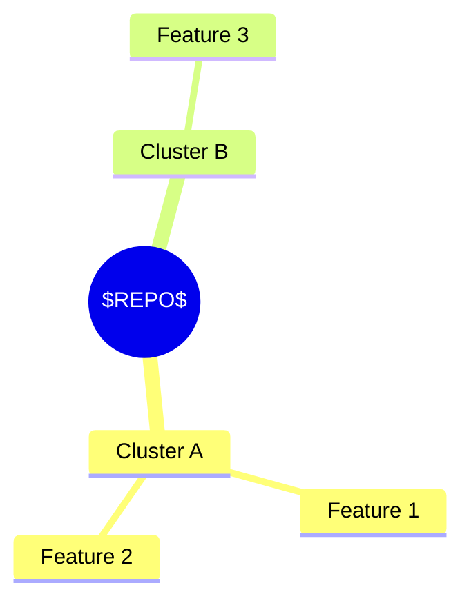
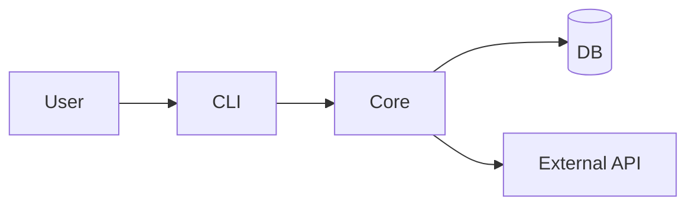
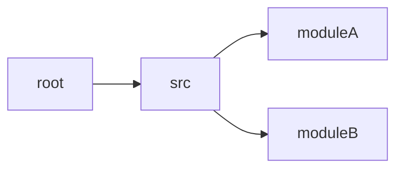
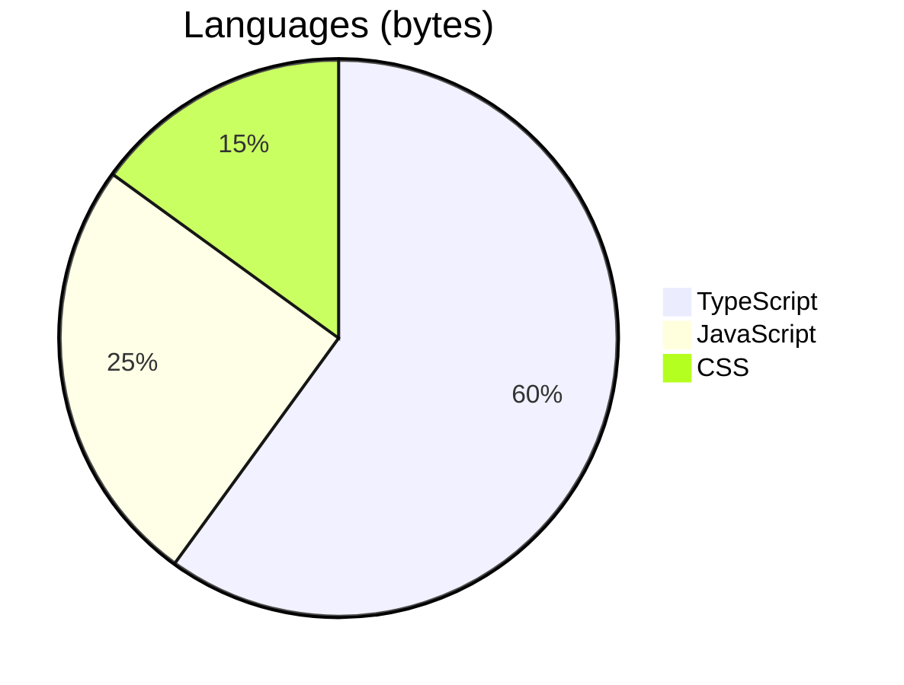
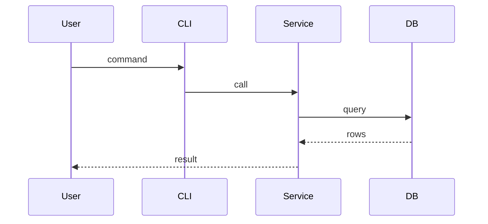
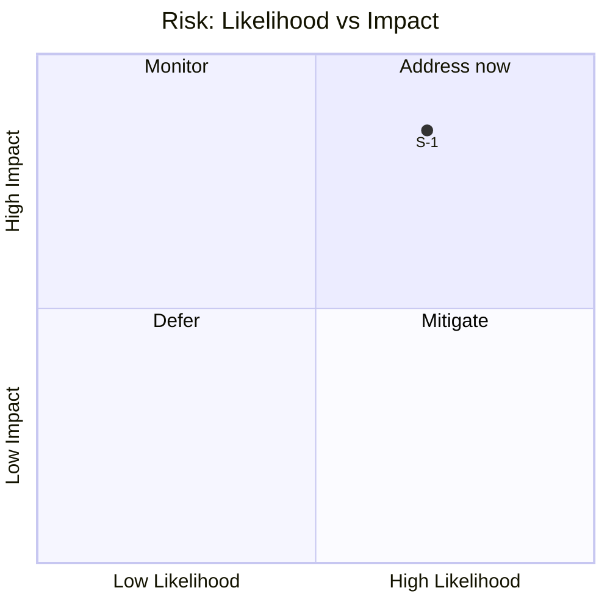

# Repo Analyzer

Two coordinated workflows:

1. **Analysis Workflow** — turn a GitHub URL into a richly visualized markdown report.
2. **Issue Workflow** — file the most recent report as an issue on the user's current repo.

The natural-language triggers in the `description` above and the slash commands `/analyze-repo` + `/issue-analysis` (under `commands/`) all enter the same workflows defined here.

---

## Analysis Workflow

Triggered by `/analyze-repo <github-url>` or phrases like "analyze this github repo: <url>".

### Step 1 — Parse and validate the URL

Accept `https://github.com/<owner>/<repo>`, `github.com/<owner>/<repo>`, or `<owner>/<repo>`. Reject anything else with a one-line error and stop.

Extract `OWNER`, `REPO`, and `TS=$(date -u +%Y%m%d-%H%M%S)`.

### Step 2 — Metadata pass (no clone yet)

Run, in parallel where possible:

```bash
gh repo view "$OWNER/$REPO" --json name,description,stargazerCount,forkCount,primaryLanguage,languages,licenseInfo,defaultBranchRef,pushedAt,createdAt,topics,homepageUrl,isArchived,diskUsage
gh api "repos/$OWNER/$REPO/languages"
gh release list -R "$OWNER/$REPO" --limit 5
```

If any of these fail with 404 → the repo is private or doesn't exist. Stop and tell the user to `gh auth login` (or pick another repo). If `diskUsage` (in KB) > 500_000 (~500 MB), skip the clone in Step 3 and proceed in **metadata-only** mode with a banner at the top of the report: `> Metadata-only analysis — repository exceeds 500 MB.`

### Step 3 — Partial clone

```bash
WORK="/tmp/repo-analyzer/$OWNER-$REPO-$TS"
mkdir -p "$WORK"
gh repo clone "$OWNER/$REPO" "$WORK" -- --filter=blob:none --no-checkout
git -C "$WORK" checkout HEAD -- .   # populate working tree (lazy blob fetch)
```

Partial clone gives full commit metadata (so `git log` is rich for popular repos) but lazy-fetches blobs. If `--filter=blob:none` fails (very old git), fall back to:

```bash
gh repo clone "$OWNER/$REPO" "$WORK" -- --depth=500
```

### Step 4 — Inventory

```bash
git -C "$WORK" ls-files | wc -l                                                 # total tracked files
git -C "$WORK" log --pretty=format:'%h|%an|%ad|%s' --date=short -100             # recent history
find "$WORK" -maxdepth 2 -type d -not -path '*/.git*' | sort                     # top-level layout
```

Detect manifests by file presence:

| Manifest | Stack |
|---|---|
| `package.json` (+ `package-lock.json` / `pnpm-lock.yaml` / `yarn.lock`) | Node / TS |
| `pyproject.toml`, `requirements*.txt`, `setup.cfg`, `Pipfile` | Python |
| `Cargo.toml` | Rust |
| `go.mod` | Go |
| `Gemfile` | Ruby |
| `composer.json` | PHP |
| `pom.xml`, `build.gradle`, `build.gradle.kts` | JVM |

See `lib/deps-detect.md` for the corresponding audit commands.

### Step 5 — Six-dimensional analysis

Fill `ANALYSIS_TEMPLATE.md` with one section per dimension. Always include the Mermaid block listed.

#### 5.1 Features — `mindmap`

Evidence: README "Features" section (if present), top-level CLI entrypoints (`bin/`, `src/cli.*`, scripts in `package.json`), exported public APIs (top-level `index.*`, `mod.rs`, `__init__.py`), route files (`app/`, `pages/`, `routes/`, `api/`), feature-flag files.



#### 5.2 Architecture & design — `flowchart LR`

Evidence: top-level module/dir boundaries, entrypoints (`main.*`, `index.*`, `cli.*`), service boundaries (Dockerfile, `docker-compose.yml`, k8s manifests), interface files. Render a C4-ish container/component view: external actors → app/services → datastores/external services.



#### 5.3 Code structure — directory `graph LR` + language `pie`

Evidence: `find -maxdepth 2 -type d`, file counts per top-level dir, language byte counts from `gh api repos/.../languages`.





#### 5.4 Key workflows — up to three `sequenceDiagram`

Evidence: top user-facing flows from README + entrypoints + handler files (e.g. CLI command handlers, HTTP route handlers, pub/sub subscribers). Pick at most 3 workflows. Trace the happy path; actors are `User`, `CLI/HTTP`, `Service`, `DB/External`.



#### 5.5 Security issues — severity table + `quadrantChart`

Run, per applicable manifest, with timeouts so a hang doesn't kill the run:

```bash
# Node
[ -f "$WORK/package-lock.json" ] && (cd "$WORK" && timeout 60 npm audit --json 2>/dev/null)
# Python
[ -f "$WORK/requirements.txt" ] && timeout 60 pip-audit -r "$WORK/requirements.txt" --format json 2>/dev/null
# GitHub Dependabot (works for all stacks; preferred fallback)
gh api "repos/$OWNER/$REPO/dependabot/alerts" --paginate 2>/dev/null
```

Plus, in-tree checks:

- **Secrets scan**: for every regex in `lib/secrets-patterns.txt`, run `git -C "$WORK" grep -nIE -f lib/secrets-patterns.txt`. Note: this lists matches but DO NOT include the matched value in the report — see "Self-redaction" below.
- **GitHub Actions**: parse `.github/workflows/*.yml`. Flag any of: `permissions: write-all`, `pull_request_target` combined with `${{ github.event.* }}` interpolations, `actions/checkout` against `${{ github.event.pull_request.head.ref }}`.
- **License**: from `gh repo view --json licenseInfo`. Flag missing or copyleft conflicts.
- **Dockerfile**: flag `FROM …:latest`, `--privileged`, hard-coded secrets in `ENV`/`ARG`.

Render:

```markdown
| ID  | Severity | Type | Component | Description |
|-----|----------|------|-----------|-------------|
| S-1 | High     | CVE  | lodash    | RCE via prototype pollution (CVE-…) |
```



#### 5.6 Possible applications — bullet list + persona table

Evidence: `description`, `topics`, README "Use cases"/"Who is this for", inferred personas from feature surface.

```markdown
| Persona | Use case | Fit (1–5) |
|---------|----------|-----------|
| Indie dev | Quick HTTP scripting | 5 |
```

### Step 6 — Self-redaction and write

Before writing the final markdown:

1. Run `git grep -nIE -f lib/secrets-patterns.txt` on the rendered report itself. If any match → replace the matched substring with `[REDACTED]` (do **not** drop the line — keep the finding visible).
2. Prepend the provenance header:
   ```html
   <!-- repo-analyzer
   source: https://github.com/$OWNER/$REPO
   commit: $(git -C "$WORK" rev-parse HEAD)
   generated: $(date -u +%Y-%m-%dT%H:%M:%SZ)
   schema: 1
   -->
   ```
3. Write to:
   - `.claude/cache/repo-analysis/$OWNER-$REPO-$TS.md`
   - `.claude/cache/repo-analysis/latest.md` (copy, not symlink)
4. Prune: keep last 20 timestamped reports.
   ```bash
   ls -t .claude/cache/repo-analysis/*-*.md 2>/dev/null | tail -n +21 | xargs -r rm
   ```
5. Show the user a 5-line summary (path + repo identity + section count + report byte size + total wall-clock). Do not dump the full report unless asked.

### Failure modes to handle

| Condition | Action |
|---|---|
| Private/404 repo | Stop. Suggest `gh auth login` or another repo. |
| Repo > 500 MB | Skip clone, metadata-only banner. |
| No deps manifest | Skip dep-audit; emit "no manifest detected" in security section. |
| `npm`/`pip-audit` missing | Skip those tools; rely on Dependabot via `gh api`. |
| Clone fails | Surface `gh repo clone` stderr, stop. |

---

## Issue Workflow

Triggered by `/issue-analysis [--repo owner/name] [--report path] [--yes]` or phrases like "create issue about analysis result", "file analysis as issue", "post the analysis".

### Step 1 — Locate the report

Default: `.claude/cache/repo-analysis/latest.md`. Override with `--report <path>`. If neither exists:

```
No cached analysis found. Run /analyze-repo <url> first.
```

Stop.

### Step 2 — Parse provenance

Read the HTML-comment header. Extract `source` (= analyzed repo URL → `ANALYZED_OWNER/ANALYZED_REPO`) and `generated` (timestamp → date for the title).

### Step 3 — Determine destination

If `--repo <owner>/<name>` provided, use it. Otherwise:

```bash
DEST=$(gh repo view --json nameWithOwner -q .nameWithOwner 2>/dev/null)
```

Run **without** `-R` so it uses the cwd's git config (i.e. the repo where the user invoked the skill).

### Step 4 — No-remote handling

If Step 3 returned empty / nonzero:

```
This directory has no GitHub remote. Options:
  1. cd into a repo with a GitHub remote
  2. Create one:    gh repo create <name> --source=. --public --push
  3. Re-run with:   /issue-analysis --repo <owner>/<name>
```

Stop. Do not prompt-loop.

### Step 5 — Confirm before posting

Always show, then wait for yes/no (skip if `--yes`):

```
About to file:
  Title:       Analysis: $ANALYZED_OWNER/$ANALYZED_REPO — $DATE
  Destination: $DEST
  Body file:   $REPORT_PATH ($BYTES bytes)
  Preview (first 10 lines):
    ...
Proceed? [y/N]
```

### Step 6 — Probe label

```bash
gh label list -R "$DEST" --search analysis --json name -q '.[].name' | grep -qx analysis && LABEL_FLAG="--label analysis" || LABEL_FLAG=""
```

### Step 7 — Create the issue

```bash
TITLE="Analysis: $ANALYZED_OWNER/$ANALYZED_REPO — $DATE"
gh issue create -R "$DEST" \
  --title "$TITLE" \
  --body-file "$REPORT_PATH" \
  $LABEL_FLAG
```

`--body-file` (not `--body`) — no shell escaping, Mermaid renders intact on github.com.

### Step 8 — Print the issue URL

`gh issue create` prints the URL on stdout. Echo it back to the user verbatim.

---

## Files referenced by this skill

- [ANALYSIS_TEMPLATE.md](ANALYSIS_TEMPLATE.md) — the markdown skeleton for the report
- [lib/secrets-patterns.txt](lib/secrets-patterns.txt) — regexes for the security pass + self-redaction
- [lib/deps-detect.md](lib/deps-detect.md) — manifest → audit command lookup
